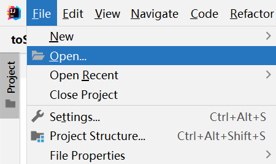
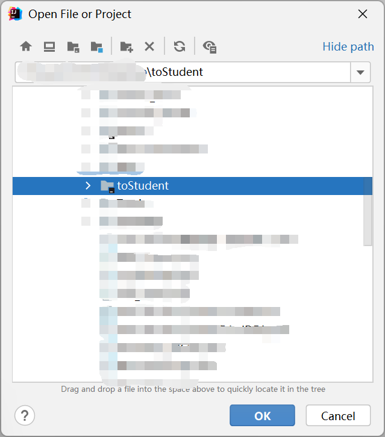
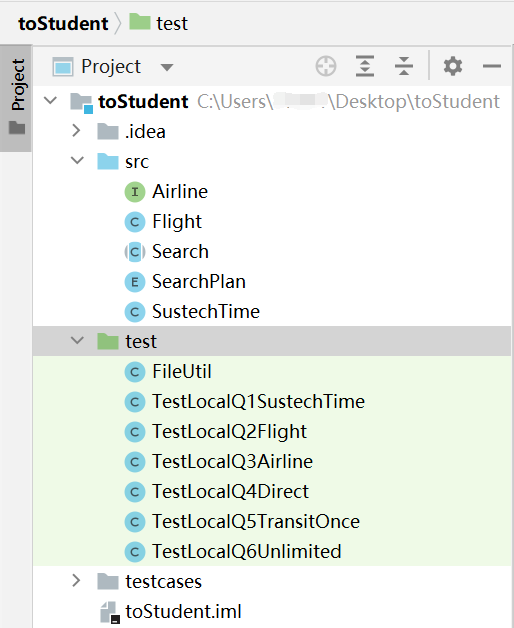
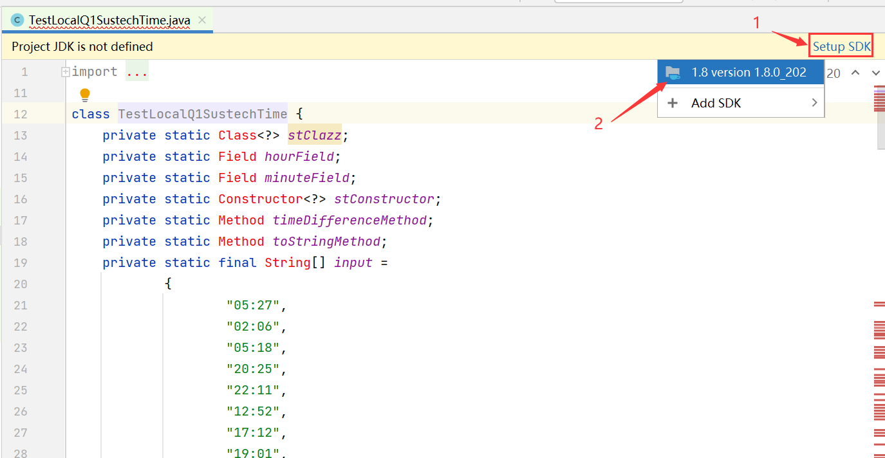
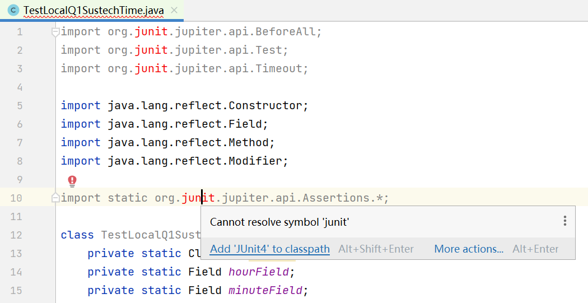
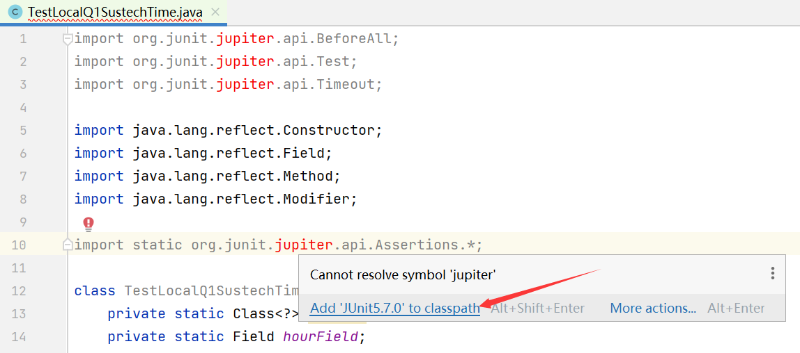

# How to Setup JUnit in IDEA:footprints:

> Produced by Tloops  2021/12/6
>
> 这是针对SUSTech 2021秋季学期 JavaA 第五次作业所写的教程

## Part 0 - 起步

首先，解压老师上传的`assignment5-to-student.zip`文件，点击进入，找到toStudent.zip文件，再次对其进行解压操作。

结果中仅需保留最后一层`toStudent`目录下的内容：

```
toStudent
    ├─src
    ├─test
    └─testcases
        ├─directsearch
        ├─in
        ├─transitoncesearch
        └─unlimitedsearch
```


## Part 1 - 使用IDEA打开代码

### 方法一：

右键点击`toStudent`文件夹，点选**Open Folder as IntelliJ IDEA Project**


稍等片刻，等待IDEA打开，IDEA正在处理您的代码。


### 方法二：

先打开IDEA，左上角File-Open...



在文件列表中找到您的`toStudent`目录文件，单击它并点选OK：



稍等片刻，等待IDEA打开，IDEA正在处理您的代码。


### 方法三：（不推荐）

将`toStudent`目录下的文件直接复制粘贴到您已有的项目之中。

- `toStudent/src`文件夹下的所有代码复制粘贴到您已有的项目的`src`文件夹下
- test和testcases两个文件夹直接复制粘贴到项目根目录下

稍等片刻，等待IDEA处理完成，IDEA正在处理您的代码。


### 随后：

等到IDEA为您配置完成之后，您应该能看到的结果是这样的：




## Part 2 - 配置 JDK

双击点开test文件夹里的第二个文件`TestLocalQ1SustechTime`，上方应该会弹出黄色的提示栏提示您`Project JDK is not defined`。此时点击右边的**Setup JDK**，在展开的项目中选择您想使用的JDK栏目，如下所示：



此项操作后，如果红色的内容减少了一些。此时项目的JDK就配置成功了。


## Part 3 - 配置 JUnit

JUnit是Java的单元测试软件，可以测试您的代码的正确性。这次作业使用这些代码也是提供了一种能让大家直接在本地测出您的代码正确与否的途径而不需要OJ的存在。

展开上面的import，你会看到`junit`都标红了：



将鼠标移到标红的任意一个`junit`标识上，会显示`Cannot resolve symbol 'junit'`的字样。点击这行字下面的**Add 'JUnit4' to classpath**，在弹出的窗口中直接点击**OK**。


等待片刻，若显示导入失败，尝试~~科学上网（VPN）~~或者等会再试吧……（可能的解决方案请看最下面的备注）


若成功导入，之后`jupiter`又会显示为红色，还是将鼠标移到标红的任意一个`jupiter`标识上，会显示`Cannot resolve symbol 'jupiter'`的字样。继续点击这行字下面的**Add 'JUnit5.7.0' to classpath**，在弹出的窗口中直接点击**OK**。



如果是别的版本也不要紧哦，只要都是`JUnit5.4`以上的版本应该都能正常运行。

之后就配置好啦，现在剩下的报错应该都是你相应的类没有写啦。


## Part 4 - 备注

1. 如果出现很多莫名其妙的报错，请**重启您的IDEA**。
2. 可能可以解决下载不了JUnit的方案（针对Windows用户）：

先移动到`C:\Users\<你的用户名>\.m2`文件夹下，创建一个叫做`setting.xml`的文件。注意请您注意您的文件扩展名，`.xml`才应该是这个文件的扩展名。

用记事本将其打开，将下面的内容粘贴到其中，保存，关闭。

```xml
<settings xmlns="http://maven.apache.org/SETTINGS/1.0.0"
      xmlns:xsi="http://www.w3.org/2001/XMLSchema-instance"
      xsi:schemaLocation="http://maven.apache.org/SETTINGS/1.0.0
                          https://maven.apache.org/xsd/settings-1.0.0.xsd">

      <mirrors>
        <mirror>  
            <id>alimaven</id>  
            <name>aliyun maven</name>  
            <url>http://maven.aliyun.com/nexus/content/groups/public/</url>  
            <mirrorOf>central</mirrorOf>          
        </mirror>  
      </mirrors>
</settings>
```

之后**重启您的IDEA**，再次尝试下载。

