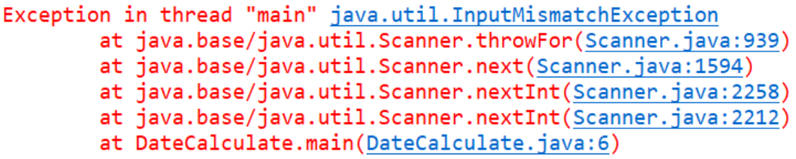

# Online Judge从入门到精通

**Produced by Tloops**	2020/03/02

## Part 1 - OJ错误提示及原因解释分析：

1. **Runtime Error**         简称：**RE** 

顾名思义，程序在运行时发生错误，抛出异常（下附常见异常）导致

2. **Wrong Answer**        简称：**WA**（哇） 

程序运行顺利，但是程序中可能出现了逻辑错误，导致程序运行结果与答案不同

3. **Compile Error**         简称：**CE**

程序编译不通过，原因可能是语法错误，或没有删除package声明语句，或类名没有改为Main

4. **Time Limit Exceeded**   简称：**TLE**

在本门课中，**TLE**的原因很可能是你的程序陷入了死循环

在以后的算法分析课程（计系专业课）中，**TLE**大多是因为算法不够优

5. **Accept**              简称：**AC**

……你成功结束了本题的挣扎，请继续挣扎下一题，或早些休息

## Part 2 - 常见异常

以下内容不仅是在做提交OJ时有用，在日常编写程序以及做Project时也很有用！

1.  **InputMismatchException** 输入不匹配异常

   一般是在使用Scanner的时候会出现，比如程序使用`input.nextInt()`语句进行读入，用户在输入时却输入了非数字字符或小数，就会抛出这样的异常。

2.  **ArrayIndexOutOfBoundException** 数组下标超界异常

   在使用数组时会出现，比如创建了一个长度为10的数组a，你去访问a[10]、a[11]、a[12]等等，就会抛出这样的异常。

3. **NullPointerException** 空指针异常

   在使用对象时会出现，比如使用对象a调用方法m()，但是a的值为null(即没有)，，就会抛出这样的异常

除了以上这些异常，还有各种各样的异常，比起寻求我的帮助，我更建议各位直接复制异常信息，粘贴到www.baidu.com，网上有很多原因分析和解决方案。（后两个分别会在学习了数组和学习了类与对象之后出现，请各位拭目以待（滑稽））

请看上图是一个异常的例子

对你们来说，有用的信息在**第一行**和**最后一行**（我用的是eclipse，IDEA可能会不同，但是大体两个信息点都会出现）。第一行出现的是**异常类型**，最后一行出现了一个数字6，表示**错误位置**，错误出现在程序的第6行。其他的是一些方法调用栈的信息，你们以后应该会学到的，现在不理解没有关系。

## 写在最后的话：

​		尽量选择自己清醒的时候写代码，不然很可能会写出一堆bug，反复的debug过程只会让你们的心情更加差劲，人也会更加浮躁。

​		学会自己搜索知识，如果你永远只停滞于接受课堂上的知识，而不进行自我探索，计算机是很难学好的。即使是课堂上的知识点，百见不如一试。试着把这些语句打出来，运行着试试看，修改写参数再试试，慢慢地你自然能熟练使用。这就像在霍格沃兹学习魔法一样，你应当尝试着去挥舞魔杖、去念出咒语，而不应该纸上谈兵，那样显然会让你失去成为主角的机会。

​		对于会有编程基础的同学，在课程的后半段，请你们认真体会Java与其他语言的区别，认真理解面向对象编程的优越性与不足，我想这样，你们在这节课才是真正有了收获。

​		对于没有编程基础的同学，请你们不用着急。这就像你刚开始玩王者荣耀，你肯定是不会的，你老是被别人虐杀，你自然体会不到这个游戏的乐趣。但是你练习某个英雄练习的多了，精通了，开始能够主宰全场了，你自然就感受到了它的快乐，并且沉迷其中。

​		行，你们啰嗦的学长唠叨了不少，祝各位编程愉快，AC常伴。