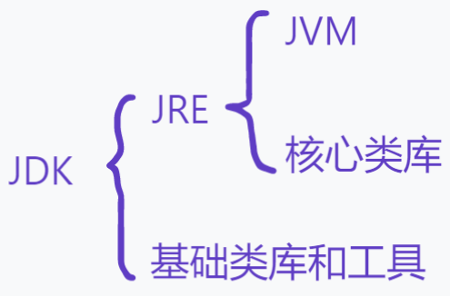
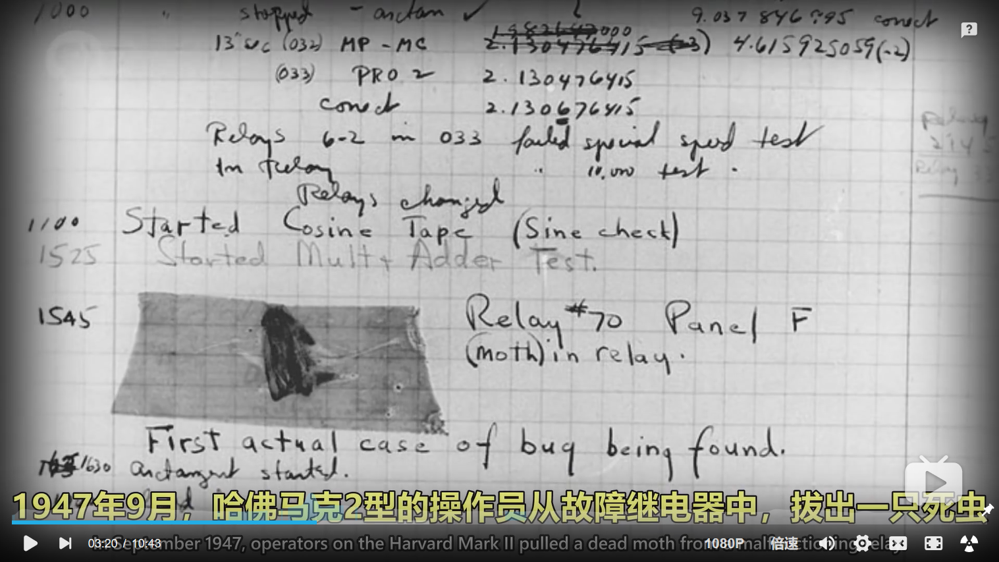

# Lesson 1 Java初期准备

​		你是用什么设备浏览这篇课件的？我想你这台设备上一定运行着几十上百个程序（如果你用的是电脑，你可以打开你的任务管理器，你会在进程一栏看到许多正在运行着的程序）：它们有的在持续进行着网络通信，保证你能够第一时间获得你同学的消息；有的在你看不见的地方默默维持着操作系统的正常工作；有的正帮助你显示这篇课件，让你能够舒适地放大缩小，上下滚动……

​		不知道你会不会好奇：既然我们计算机可以执行多种多样的程序，为什么它不能直接运行Java程序呢？


## 1 计算机究竟能看懂什么

​		不难发现，Java中包含不少英文单词或缩写，而计算机能直接理解这些英文吗？答案是否定的。《失控玩家》中，键盘说过：“我热爱代码，因为人类的语言会骗人，0和1不会”。而计算机能直接看懂的，就是0和1的特殊序列，我们也叫它**字节码**（Byte-code）。

​		既然计算机只能识别并执行字节码，普通的程序又如何得以运行呢？当然需要一个翻译官啦！这个翻译官就是**编译器**（Compiler）。这也是一种程序哟，它读入你的Java代码，通过编译操作（类似于逐句翻译）将其转换为对应的字节码，这样你的计算机就可以直接运行它了！


## 2 JDK是什么？我们为啥有了它才能用Java？

​		正如上节所说，显然我们需要编译器才能执行Java代码。而JDK中正好就装配了编译Java代码所需要的编译器。而且除此之外，它还含有JVM（Java Virtual Machine），用于执行翻译过后的Java程序。另外，Java本身也提供了一些基础的库函数，通过这些方便的库函数可以让你完成一些简单的操作。比如输出所需要的`System.out.println()`，输入时所需要的`Scanner`类，都是包含在这些库函数中的，而这些正包含在JDK中的JRE（Java Runtime Environment）中。对了，差点忘了JDK的全称：Java Development Kit（Java开发工具包）。

​		其中几个名词的具体的关系请见下面的图：



​		因为JDK包含了这些执行Java代码需要的东西，我们才非他不可！


## 3 Java

​		Java是一种**高级语言**，这是相比于字节码而言的。高级语言更贴近人类的自然语言，使人类更易编写，也使人类更易理解。不妨给大家看看Java语言和相对应字节码的Hello World程序是什么样的：

```java
public class Demo {
    public static void main(String[] args) {
        System.out.println("Hello World.");
    }
}
```

```
cafe babe 0000 0034 001d 0a00 0600 0f09
0010 0011 0800 120a 0013 0014 0700 1507
0016 0100 063c 696e 6974 3e01 0003 2829
5601 0004 436f 6465 0100 0f4c 696e 654e
756d 6265 7254 6162 6c65 0100 046d 6169
6e01 0016 285b 4c6a 6176 612f 6c61 6e67
2f53 7472 696e 673b 2956 0100 0a53 6f75
7263 6546 696c 6501 0009 4465 6d6f 2e6a
6176 610c 0007 0008 0700 170c 0018 0019
0100 0b48 656c 6c6f 2057 6f72 6c64 0700
1a0c 001b 001c 0100 0444 656d 6f01 0010
6a61 7661 2f6c 616e 672f 4f62 6a65 6374
0100 106a 6176 612f 6c61 6e67 2f53 7973
7465 6d01 0003 6f75 7401 0015 4c6a 6176
612f 696f 2f50 7269 6e74 5374 7265 616d
3b01 0013 6a61 7661 2f69 6f2f 5072 696e
7453 7472 6561 6d01 0007 7072 696e 746c
6e01 0015 284c 6a61 7661 2f6c 616e 672f
5374 7269 6e67 3b29 5600 2100 0500 0600
0000 0000 0200 0100 0700 0800 0100 0900
0000 1d00 0100 0100 0000 052a b700 01b1
0000 0001 000a 0000 0006 0001 0000 0001
0009 000b 000c 0001 0009 0000 0025 0002
0001 0000 0009 b200 0212 03b6 0004 b100
0000 0100 0a00 0000 0a00 0200 0000 0300
0800 0400 0100 0d00 0000 0200 0e
```

字节码来自[Linux公社](https://www.linuxidc.com/Linux/2018-03/151358.htm?utm_source=tuicool&utm_medium=referral)


## 4 “Hello World”的由来

​		“**Hello World** 中文意思是『你好,世界』。因为《The C Programming Language》中使用它做为第一个演示程序，非常著名，所以后来的程序员在学习编程或进行设备调试时延续了这一习惯。”所以在入门所有计算机语言时，你都会看到这样的一段示例程序。（引自[百度百科](https://baike.baidu.com/item/hello%20world/85501?fr=aladdin)）


## 5 “bug”一词的由来

​		我们都知道，早期的计算机是非常之大的，比如下面这台Harvard Mark II。这些大型的温暖的机器也会吸引昆虫。1947年9月，操作员就从这台大型计算机故障的继电器中，拔出来一只死虫。从这以后开始，当我们发现计算机出了故障，我们就说这电脑有了**bug**。




（引自[Crash Course Computer Science](https://www.bilibili.com/video/BV1EW411u7th?p=2) 03:19 ~ 03:34）

