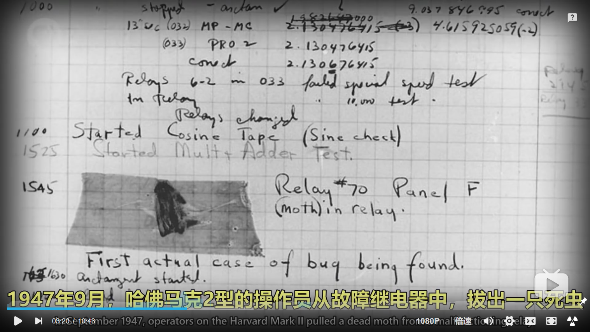

# Lesson 02 - 第一个Java程序

从示例程序开始入门吧！这节课我会重点强调如何让你的Java代码跑起来，以及Java程序的基本结构。在前面我提到过，要学会适当地囫囵吞枣，有些观念现在你们可能还无法理解，但是再过一段时间你们就好理解了。所以有些时候也要少钻牛角尖哦~


## 1 Hello，World！

下面的程序`Main.java`想要输出`Hello, World`

```java
public class Main {
	public static void main(String[] args){
		System.out.println("Hello, World");
	}
}
```

你现在会觉得Java就硬花里胡哨（x），又是class又是main的，套了两层不知道啥东西，终于开始写需要执行的代码了。你们会在几节课后理解这外面两层是什么鬼东西，而现在你们只需要知道每个程序都要按照这样写就行了。按照规范，我们暂时认为**一定要将语句套在这样的两层花括号**内，才能得到执行。

`System.out.println()`这句话看似很长，但是现在不用管它到底是什么样含义。你现在只需要知道它表示希望程序打印小括号内的内容。如果是一句话，记得要放在双引号内哦~


## 2 类（class）

关于类与对象，这将是你们课程后半段的重点内容。不过为了让你们的程序能跑起来，现在还需要强调一点。先看看这一块内容：

```java
public class Main {
	...
}
```

`public class`是每个程序都需要写的一个东西，也就是**主类**，而后面跟着的`Main`只是一个名字，你可以将其改为其他任何东西（不要有特殊符号也不能有空格，严格地说，需要遵循Java标识符的要求），可以叫`Demo`、也可以叫`ABaABa`，但是不要忘记，**这个名字一定要和这个程序的文件名**（不包含后缀`.java`）**相同**。比如如果是`public class ABaABa`，文件名就得是`ABaABa.java`。如果你让这两个位置的内容不同了，你应该会得到一个编译错误，也就是说这样你的代码是无法运行的哦。


## 3 主方法（main method）

​		当我们执行一个Java程序时，JVM如何判断你要从哪里开始执行你的程序呢？答案就是找主类中**主方法**的位置。一个类中有主方法，说明这是一个可以直接被运行的Java应用程序。在运行前，JVM会确定`public static void main(String[] args)`这串东西的位置，从这个东西后面的大括号后的下一条语句开始执行，一直到该大括号对应的反括号为止则程序运行完毕。

```java
public static void main(String[] args) {
	...
}
```

​		因此，必须这么定义主方法，这是Java的规范，否则程序将无法确定开始执行你的程序的位置。在讲到方法一节时，我会再次深入剖析这个东东的构造。


## 4 语句和代码块

​		看了上面的内容，你显然已经熟悉了这个**大括号 {...}**。当我们使用判断、循环等语句，以及声明类、方法时，需要将相应的内容用**大括号 {...}** 括起来，这就是**代码块**，以此来区分开不同功能或不同执行条件的代码。

​		此外，一般在每一句语句后都要使用 **分号 ;** 来表示**语句的结束**，因为编译器会识别分号来确定当前语句是否已经结束，如果在一行末尾没有找到分号，那么它会将其下一行语句视为直接跟在上一行语句之后的，从而很可能导致编译错误。请看下面的两份代码，它们从编译器角度来看是完全相同的。

```java
int a = 0;int b = 0;int c = a+b;System.out.print(c);
```

```java
int a = 0;
int b = 0;
int c = a+b;
System.out.print(c);
```

其实之所以我们每行只写一个语句，或是代码块内的代码做缩进对齐的操作，这都只是为了美观，即让写的人感觉清晰易懂，让看的人感觉神清气爽而已。所以你完全可以做出将所有语句全放在一行的阴间操作，但我保证没有学助会愿意给你debug的，而且希望你不要被他打死（x）。


## 5 注释（comments）

​		注释是会被编译器忽略的文本内容，注释方法有两种：// 和 /* */ 

```java
public static void main(String[] args) {
	// <- 行注释：仅注释掉本行内容
	System.out.println("我没有被注释哦！");
    /*
        中间的内容
        都会被
        注释掉
    */
}
```

注释的作用主要是：

- 为复杂的代码提供一目了然的**注解**，在多人协作项目时尤其重要

- 在调试时**快捷删改代码**。

小技巧：在大部分IDE中都可以使用**Ctrl+/**快捷键注释掉光标所在行，如果已经框选中好几行的内容，则选中的行都会被注释。


## 6 “bug”一词的由来

​		我们都知道，早期的计算机是非常之大的，比如下面这台Harvard Mark II。这些大型的温暖的机器也会吸引昆虫。1947年9月，操作员就从这台大型计算机故障的继电器中，拔出来一只死虫。从这以后开始，当我们发现计算机出了故障或程序没有得到预期的输出结果，我们就说这电脑或程序有了**bug**。




（引自[Crash Course Computer Science](https://www.bilibili.com/video/BV1EW411u7th?p=2) 03:19 ~ 03:34）

