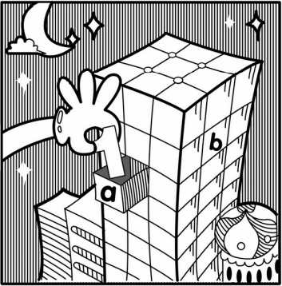

# Lesson 03 - 八种基本数据类型

想象你需要计算南方科技大学本科计算机系的男女比是多少。

我们来仔细想象你的脑袋瓜要经历怎样的计算步骤：

1. 用大脑**记住**计算机系男生的数量
2. 用大脑**记住**计算机系女生的数量
3. 用大脑将两个数字相除
4. 得到结果
5. 告诉你的朋友这个比例是真**的高

在这个过程中，出现了两个大家可能不会想到的步骤，那就是要**记住某个数字**。

而为了让计算机也能做计算，我们需要计算机也**存储**着运算所需的数据。当我们需要一些数据进行运算时，我们某种方式去方便快捷地**访问**这些数据。

“其实计算机的大脑就像一个‘摩天大厦’，有很多很多一间一间的‘小房子’，计算机就把需要记住的数放在‘小房子’里面，一个‘小房子’只能放一个数，这样计算机就可以记住很多数了。”



（上述文段及图片引自啊哈磊 《啊哈C语言》）


## 1 变量

刚才所说的“摩天大厦”就是计算机的**内存（Memory）**，而“小房子”则是**变量（variable）**。为了能让“数据访客”住进我们的“摩天大厦”，我们得给他们分配“小房子”才行，也就是去创建变量。

创建变量有几个要素：

- **变量名**：区别不同变量，也可以通过变量名去访问相应变量对应的数据
- **数据类型**：这会决定这个变量里所存储的数据的类型，变量类型有很多种，比如整型、浮点型等。
- 初始值：一般在创建一个变量的时候，我们都需要赋给它一个初始值，也就是给它一个初始数据。如果你不这样做却直接访问这个变量，这样程序会报告一个错误，并且无法运行哦。

从本质上来看，创建变量就是为即将到来的数据分配一块内存，用于存储这个数据。同时我们将这块内存的地址与你自定义的变量名相对应，让你能够“叫名字”这种简单的方式去访问这个数据，而不是去记住这个数据的地址去访问这个数据。就好像，你是更愿意“孙悟空，我叫你一声你敢答应吗？”这样叫一个人，还是“东胜神洲傲来国花果山水帘洞第一洞口101室住着的猴子，我叫你一声你敢答应吗？”这样呢？

从代码上来看，我们可以这样去声明一个变量，并给他一个初始值：

```java
// <data_type> <variable_name> = <initial value>;
// Example:
int x = 1;
double GPA = 4.0;
```

计算机一开始本就是为了计算而生，那么知道了怎么声明一个变量，现在怎么做计算呢？计算机里的加和减还是**+**和**-**，而乘号和除号有点难打，于是就改用了**星号\***和**斜杠/**分别代表乘和除。

```java
int y = x + 2;
GPA = GPA / y;
```

对了，你现在看到的**等号=**在Java中是**赋值**的意思，即将等号右边变量或算式结果的值赋值给等号左边的变量。


## 2 八种基本数据类型

光会分配“小房子”可不行，你还得知道什么样的“数据访客”需要什么样的“小房子”，也就是它们的**数据类型（data type）**。在Java中，总共有8种**基本数据类型（primitive data type）**。一看有基本的数据类型就知道还有不基本的，先告诉你们，**String**这种类型就是不基本的，具体的咱们下次再提。


### 整型

主要用来存储整数，一共有四种：

1. **byte**类型能存储 **-2的7次方~2的7次方-1** 之间的所有整数，-128到127
2. **short**类型能存储 **-2的15次方~2的15次方-1** 之间的所有整数，大概是3.2万
3. **int**类型能存储 **-2的31次方~2的31次方-1** 之间的所有整数，**int是最常用的整型数据类型**，大概是21亿
4. **long**类型（长整型）能存储 **-2的63次方~2的63次方-1** 之间的所有整数，比int所需的空间更大，为了节省内存，一般都使用int，但是当int范围不够存储不了的时候还是得靠long咯！

> 思考1：这些类型所能存储的数据的范围有什么规律？为什么会有这种规律呢？
>
> 思考2：如果有在long的范围之外的整数，我们该如何存储呢？


### 浮点型

主要用来存储非整数，一般达不到完全精确，甚至连有限小数乘整数，乘着乘着就丢了精度。主要有以下两种：

1. **float**单精度浮点类型，精度较低
2. **double**类型，顾名思义，双精度浮点类型，虽然占用内存是float的两倍，但是更加精确。在这个内存足够大的时代，**double类型已经成为了人们最常用的浮点型数据类型了**


### 布尔型

就一种，也就是**boolean布尔值**，能存储的值也只有两种：**true**和**false**。

判断表达式的结果类型就是布尔值。为了声明一个boolean类型的变量并存储真值true，我们需要这样写：

```java
boolean isLeapYear = true;
```


### 字符型

计算机里可不能只有数字，为了能正常显示字符，我们拥有了字符型**char**，用于存储单个的字符。为了声明一个char类型的变量并存储字符**'?'**，我们需要这样写：

```java
char questionMark = '?';
```


在理解了八种基本类型之后，我们就可以给不同的数据住适合它们住的小房子啦。


## 3 直接量

直接量是程序中直接使用的数据值。

程序中直接出现的整数值**默认为int类型**，出现的浮点数值**默认为double类型**，这也是为什么这两种类型成为相应数据大类的主流的原因了。另外，boolean类型只有两种直接量**true和false**。char类型的直接量需要**用单引号包住相应的单个字符**。

虽然String类型不是基本类型之一，但是它的直接量用的非常多，所以在这里也有必要提上一嘴。上一课见到的Hello World示例程序中就出现了，我们需要**用双引号包住相应的字符串**。

```java
String s = "This is the end of this lesson!";
```


## 附一些想说的话

啊哈磊老师是我的编程启蒙老师之一。他所写的生动形象的《啊哈C语言》是我的第一本编程书。这本书一定影响了现在的我，它时刻告诉我，要把编程知识讲的通俗易懂，尤其是启蒙阶段时，是需要这些生动的比喻的。我想，我现在所受的“关注”，一定离不开老师当年的教导对我潜移默化的改变。

