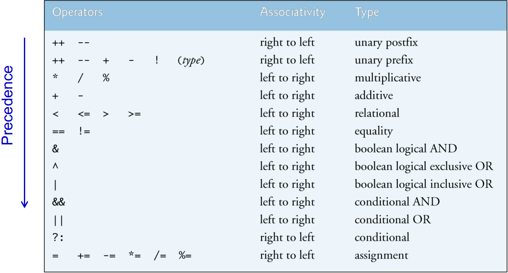

# Lesson 05 - 操作符及其优先级、类型转换

现在的你，一定已经掌握了如何让程序“听”到你的输入，也熟知了如何让程序“说”出它的输出。接下来我们得学习一下中间的步骤：如何处理输入，使其转变为咱们想要的输出。第0节课我们讲到，编程学习的是两样东西：

- 基础指令（操作）的效果
- 如何将这些基础指令排列组合使其能做到某件复杂的事情

那么我们先打好基础，在看那些花里胡哨的指令之前，先看看这些操作符。


## 1 基本操作符

之前已经介绍过这些基本的操作符：

- `+-*/`：加减乘除
- `=`：**赋值**，将等号右边的值赋值给左边的变量，注意这个等号左边必须是一个变量哦！

除此之外，我们还有比较常用的：

1. **取余**：`%`

   用前一个操作数去除以后一个操作数，将余数作为结果返回，如5 % 2 = 1，27 % 7 = 6

2. **自增和自减操作符**：`++`和`--`

   这是一个一元操作符，意思是它**只能有一个操作数**。自增操作符可以让这个操作数的值加上一个一，自减操作符则相反，会让其减一。如执行了`x++;`和`y--;`之后x的值会+1而y的值会-1。

   可惜这东西没看起来这么简单，它甚至有两种用法，前缀用法和后缀用法：

   ```java
   int x1 = 1, x2 = 1;
   int y = x1++; // 后缀用法
   int z = ++x2; // 前缀用法
   System.out.printf("x1 = %d, x2 = %d\n", x1, x2);
   System.out.printf("y = %d, z = %d", y, z);
   ```

   输出：

   ```
   x1 = 2, x2 = 2
   y = 1, z = 2
   ```

    从输出的第一行我们可以发现，无论是前缀还是后缀用法，操作数`x1`和`x2`最终都加了1，变成了2。

   但是，从输出的第二行我们可以发现，这东西的结果是不同的。后缀用法中，结果`y`为操作数`x1`的原值；前缀用法中，结果`z`为操作数`x2`在自增后的新值。当然，如果你觉得你搞不清楚这个东西，那么，像这样分开写就是你最好的选择：

   ```java
   int y = x1;	x1++;
   x2++; int z = x2;
   ```

   别忘了，你们还是得熟悉这个呀，毕竟考试有可能会考，可以自己多试试哦！

3. **组合赋值操作符**：`+=`、`-=`、`*=`、`/=`、`%=`

   这个东东有点像自增操作符的升级版，不过现在咱们不仅限于可以+1或者-1，我可以加任意的数了。如`x += 233;`就表示`x = x + 233;`，后四种操作符和`+=`同理。当我们希望对一个变量本身进行值的累加或累乘等的时候，可以考虑使用这些个操作符哦！


在下一节课《判断》中，正好是**比较操作符**和**逻辑操作符**们的主场，在这节课我们先请这几位重量级嘉宾先来一个自我介绍：

- **比较操作符**：比较两边的数或者变量，结果是一个布尔值（true或false）。条件成立时，结果为**true**，不成立时结果为**false**。如假设x为666，`x == 666`结果为true，而`x <= 0`结果为false。（在课上这里可以讲讲char类型的比较）比较操作符主要有以下六种：
  - `>`：**大于**符号！左边的操作数比右边的大时为true，否则为false
  - `<`：**小于**符号！左边的操作数比右边的小时为true，否则为false
  - `>=`：**大于等于**咯，不多解释啦
  - `<=`：**小于等于**咯，不多解释啦
  - `==`：**等于**符号！左右两操作数相等时为true，否则为false。注意这个是两个等号连在一起的哟，千万不要和单走一个等于号的赋值操作符搞混了！
  - `!=`：**不等于**符号！左右两操作数不相等时为true，否则为false
- **逻辑操作符**：用于计算两个布尔值
  - `&&`：“**逻辑且**”操作符，当前后两个布尔值（可以理解为事件）的真值都为true时结果为true，否则为false
  - `||`：“**逻辑或**”操作符，当前后两个布尔值的真值都为false时结果为false，否则为true
  - `!`：“**非**”操作符，一元操作符，可以倒转当前布尔值的真值作为结果，即true变false，false变true
  - `^`：“**异或**”操作符，当前后两个布尔值的真值不同时结果为true，否则为false，**初学者不常用**

|  x   |  y   | x && y | x \|\| y | ! x  | x ^ y |
| :--: | :--: | :----: | :------: | :--: | :---: |
|  T   |  T   |   T    |    T     |  F   |   F   |
|  T   |  F   |   F    |    T     |  F   |   T   |
|  F   |  T   |   F    |    T     |  T   |   T   |
|  F   |  F   |   F    |    F     |  T   |   F   |


## 2 操作符优先级

来看这样一个小学数学题：`1+22/11*(8-3)`

应该几秒钟你就能算出答案吧。在这个过程中，你好像立刻就知道要先算`22/11`或者先算最后括号里的`8-3`，这是因为你早已熟悉四则运算的运算顺序：先乘除，后加减，括号内容算在先。在Java的世界里，操作符更多，它们也得有规定好的运算顺序才行。要知道，计算机语言也都是人类设计出来的，所以，它至少会尽可能去适应人类习惯的法则，比如上面的四则运算顺序就被Java都遵守着。话不多说，直接看看我当年学的时候刘烨庞老师课件里的这张表格吧：



这张图中，操作符优先级从下到上越来越高。我觉得大家可以不用死记硬背，主要记住**赋值操作符的优先级是最低的**就好了，其实考试中也基本没有涉及过这个知识点。在编程实践中，如果你不确定哪个更优先，**使用括号把你想要先算的括起来就好啦**！


## 3 类型转换

