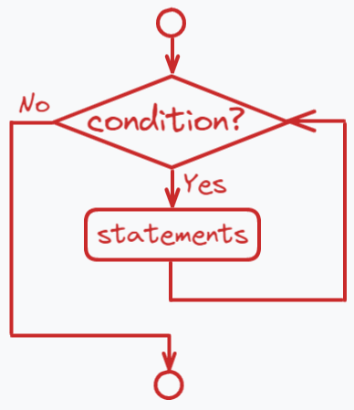
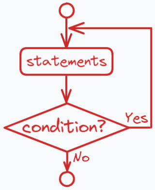
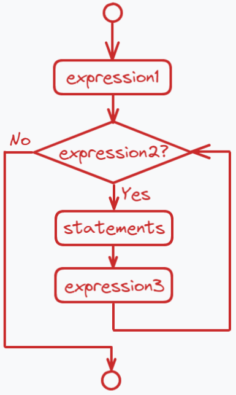

# Lesson 07 - 循环、变量的作用域

A：“你是猪”

B：“你有本事就说10遍”

A：“你是猪你是猪你是猪你是猪你是猪你是猪你是猪你是猪你是猪你是猪”

B：“好啊，那你有本事就说100遍”

A：“你是猪你是猪你是猪你是……不对啊，我有毛病啊，我凭什么说一百遍……”

B：“所以你才是猪”

……

我偶然想起小学时这样的一段对话，对话是跟谁我早已不太记得，但总觉得很怀念那样的日子……不对，好像偏题了……

咳咳……回归正题，人类显然并不喜欢做反复且单调的工作，即使是把一句只有三个字的“你是猪”说上个十来遍，人类也会觉得厌烦。然而，这却是计算机轻轻松松就能做到的。就在此时此刻，你的设备就在以每秒几千甚至几万次的速度做着一件件枯燥无味的事情：不断检查网络上是否有发给你的数据包、进行进程切换等等。不如说，计算机最擅长的就是**按部就班和循环往复**。你让它做100遍的事情它绝对会一点不差地做上一百遍，一遍不多，一遍不少。没有人情冷暖，也不会想要偷懒。所以好好学习循环，好好利用计算机所能做到的最擅长的事情。


## 1 循环

### while

我们直接来看看怎么写**while循环**的代码：

```java
while(condition) {
    statements;
    ...
}
```

- `condition`：一个布尔值（可以理解为一个事件）。若为真，则继续循环；若为假，则跳出循环
- `statements`：循环体，当condition成立时则会执行

具体的过程解释：当程序执行到`while`语句块时，会**先**判断`condition`是否为**true**。若为**true**，则执行一遍循环体；否则将继续执行while语句块之后的语句。

希望下面的流程图可以帮助大家具体化地熟悉整个流程：



那么**循环的要素**是哪些呢：

1. 循环继续（跳出）的**条件**
2. 循环体的**具体内容**，注意那些不变的逻辑
3. 注意每次迭代**哪些变量需要变**


### Example

在继续看其他的循环结构之前，我们先来看一个简单的例子：

#### 输出所有三位数的水仙花数

水仙花数：个位数的立方+十位数的立方+百位数的立方=这个数本身

在这节课的开头的时候我就说过，注意计算机最适合做重复的工作。所以比起探索出水仙花数的构造规律，计算机最会干的反而是**枚举法**。每当需要尝试的数的集合是有限集时，都可以考虑使用枚举法！在这个题中，我们枚举所有的三位数，逐个判断其是否是一个水仙花数。


大家可以先自己尝试写出来，再看下面的解释以及标准程序哦！


首先我们设一个**变量i**，用于装要检查的那些数。初始我们将其设为100，从100开始逐个检查，因为100是第一个三位数。

注意刚刚说的循环的三要素：

- **继续条件**：或者这里就是说我们要枚举哪些数嘛，肯定是100~999之间的所有的三位数，由于初始i为100，而最终i为999，也就是说**i**满足`i <= 999`时，都要继续进行检查操作
- **变的变量**：这里我们为了简单，我们就逐个逐个地来进行判断每次循环的最后，我们都执行`i++`，这样下次迭代就会检测下一个待测数
- **循环体**：也就是不变的那一部分逻辑，这里自然就是检查**i是不是一个水仙花数**，判断大家已经在上节课学过，在这里我就不作赘述

接下来就是标准程序啦：

```java
public class TestNarcissus {
    public static void main(String[] args) {
        
        System.out.println("3-digit narcissus numbers: ")\
            
        int i = 100; // starts from 100
        while(i <= 999) { // ends at 999
            
            // get the number of each digit
            int bai = i / 100;
            int shi = i / 10 % 10;
            int ge = i % 10;
            
            // judge if i is a narcissus number
            if (bai*bai*bai + shi*shi*shi + ge*ge*ge == i) {
                System.out.println(i);
            }
            
            // remember to go to the next i
            i++;
        }
    }
}
```


### do-while

我们直接来看看怎么写**do-while循环**的代码：

```java
do {
    statements;
    ...
} while(condition)；
```

- `condition`：一个布尔值（可以理解为一个事件）。若为真，则继续循环；若为假，则跳出循环
- `statements`：循环体，当condition成立时则会执行

具体的过程解释：当程序执行到`do-while`语句块时，会**先**执行一遍循环体，再判断`condition`是否为**true**。若为**true**，则再次执行循环体；否则将继续执行do-while语句块之后的语句。

流程图如下：



通过对比**while循环**和**do-while循环**的流程图，我们可以发现二者的区别：**while**是先判断再执行循环体；而**do-while**是先执行循环体再判断的。也就是说，**do-while循环**的循环体**无论如何一定会执行一遍**。另外要注意**do-while**的最后是要打分号的哦！


### for

我们直接来看看怎么写**for循环**的代码：

```java
for(expression1; expression2; expression3) {
    statements;
    ...
}
```

- `expression1`：仅在第一次进入for循环时执行一次，一般用于做**初始化**操作
- `expression2`：一个布尔值（可以理解为一个事件）。若为真，则继续循环；若为假，则跳出循环
- `expression3`：每次执行循环体之后都会执行，一般用于做**变量更新**操作
- `statements`：循环体，当`expression2`成立时则会执行



> 思考一下：水仙花数的示例代码的**while**循环该如何改为**for**循环呢？


### break和continue

在循环过程中，有时我们想要**直接结束这个循环**，这个时候可以用到`break`语句。

而有时我们想要**直接结束当前迭代循环体，进入下一次迭代**，这个时候可以用到`continue`语句。注意在for循环中，即使使用了`continue`语句，上面所说的`expression3`依然会执行。


### 对比

刚刚展示了三种循环结构，其实这三种循环结构直接都可以相互转换，但是为了方便和优雅，我们会按照他们各自的特性来使用他们：

1. **while循环**：相比于do-while循环，用于循环体可以一次都不执行的情况；相比于for循环，用于初始化或更新变量较复杂的情况，一般已知一个跳出条件
2. **do-while循环**：相比于while循环，用于循环体一定要执行一次的情况
3. **for循环**：常见用于已知循环次数的循环（此时我们会用**i或j**等变量计数），用于初始化或更新变量较简单的情况，因此非常适合用于数组的遍历


### 练习

1. 猜数游戏

   程序生成一个1~100以内的随机数（`(int)(Math.random() * 100 + 1)`），之后不断让用户输入自己猜的数字。若猜对了，打印恭喜的小短语，结束程序；若没猜对，告知用户目标数是比他刚才猜的数字大还是小。

2. 输出从2开始的前n个质数


## 2 变量的作用域

变量的作用域，指的是**变量可以被使用的范围**。

不难知道，一个变量首先需要被声明才可以被使用，在其被声明前是无法被使用的。

```java
i = 1; // compile error, because here we can't find i
int i = 999; // declare i
i = 1; // successfully find i
```

学过了判断和循环后，我们使用代码块的频率越来越频繁了。代码块就是用**大括号**包起来的一部分代码。我们要注意，在某一块代码块内声明的变量，仅在当前代码块内有效，在代码块执行结束后，这个变量的空间就会被释放，在代码块外是不能引用到这个变量的。循环中声明的变量，也只在当前迭代有效。

```java
i = 1; // compile error, because here we can't find i
j = 1; // compile error, because here we can't find j

if (true) {
	int j = 0;
}

for(int i = 0; i < 10; i++) {
	System.out.println(i); // successfully find i
}

i = 1; // compile error, because here we can't find i
j = 1; // compile error, because here we can't find j
```

