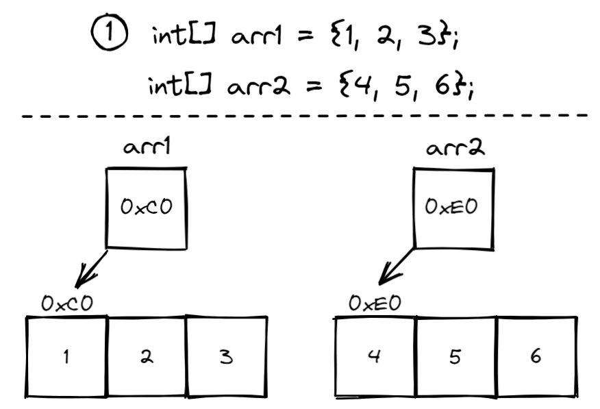
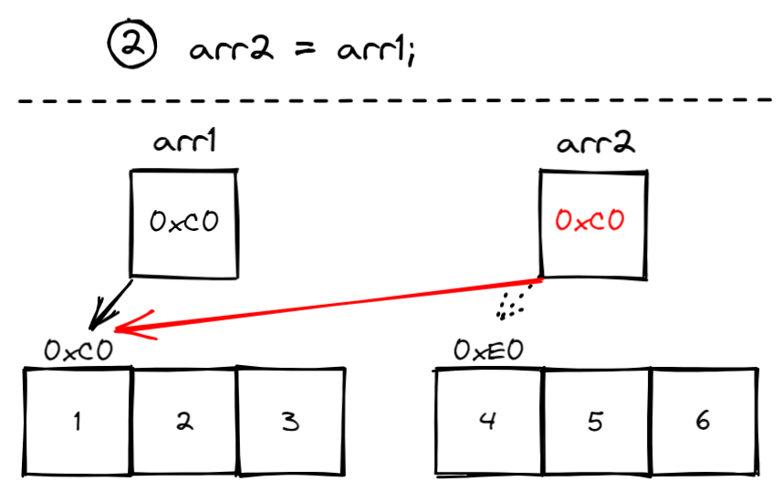
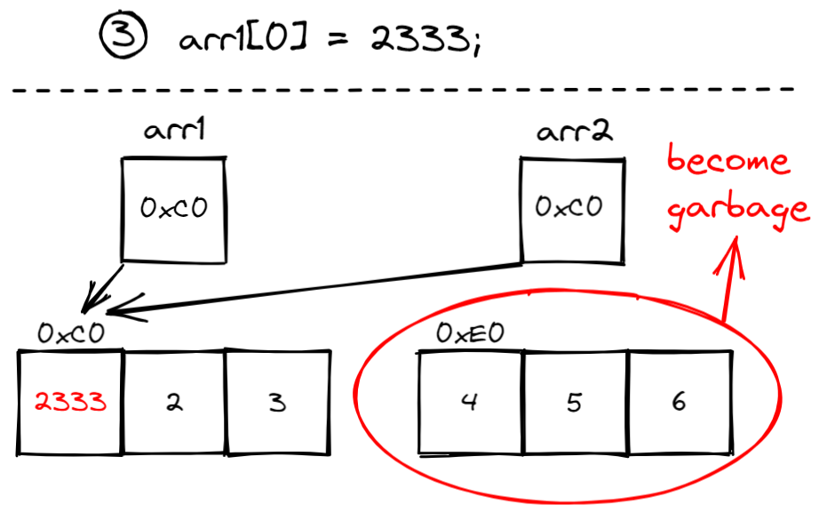
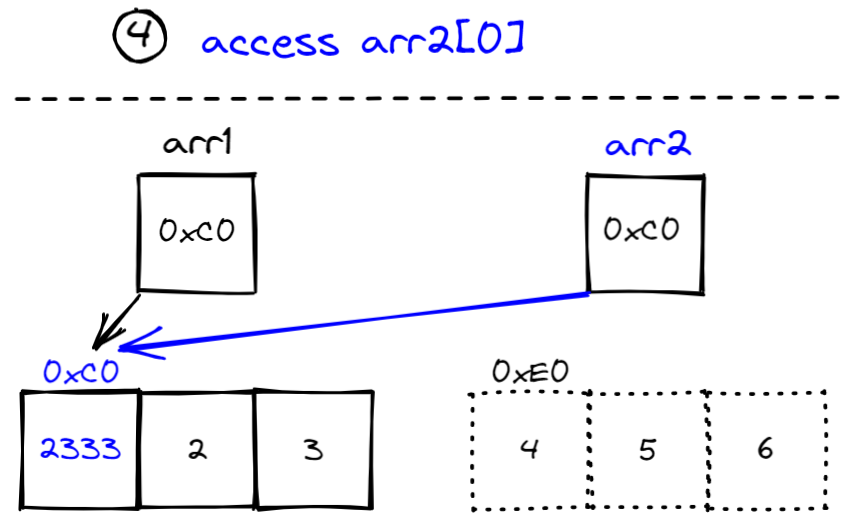

# Lesson 08 - 数组和引用变量

在执行程序的过程中，我们常常需要存储大批量的数据。班级中每位同学的成绩，测量得到的实验数据，甚至到深度学习需要用到的数据集，都是数量比较庞大的。如果我们一个个去声明变量，我们肯定要花上成千上万行去一个个声明、赋值、处理、输出。而此时，**数组（Array）**正在赶来的路上……


## 1 数组的定义

数组是用来**存储相同类型数据的变量的集合**。为了方便地存储大批量的数据，我们应当选择去创建数组。比如说，我们要读入全年级1000来人Java这门课程的成绩，计算它们的平均值，再比较哪些人的成绩大于这个平均值。为了完成这个任务，我们应该将这么多成绩都存起来，存到程序中的变量里。在传统的视角下，我们需要声明1000多个变量：

```java
double gpa1 = in.nextDouble();
double gpa2 = in.nextDouble();
...
double gpa1000 = in.nextDouble();
```

这也太麻烦了吧，甚至都有一点不太现实。

所以当我们**有大量数据需要存储**时，我们便可以考虑**使用数组**，然后通过for循环对其一个个进行赋值：

```java
double[] gpaArray = new double[1000];
for (int i = 0; i < 1000; i++) {
    gpaArray[i] = in.nextDouble();
}
```


## 2 数组的声明、创建和访问元素

### 声明：

```java
elementType[] arrayName;
double[] gpaArray;
```

在声明时，我们需要指定数组中存储元素的类型以及数组的名字，我们将一个中括号添加到类型的后面来表示这是一个一维数组类型的**引用变量**。

### 创建：

```java
arrayName = new elementType[length];
gpaArray = new double[1000];
```

在创建时，我们实际上在做的是一个赋值操作，就和一般的变量初始化很像。我们把注意力放在赋值操作符的右边：这里我们使用`new`关键字表示要为这个数组开辟新的内存空间，中括号中的`length`就表示这个数组的长度。这样我们就得到了一个长度为length，存储的数据类型为`elementType`的数组。

而一般我们会将声明和创建写在同一条语句，就像普通变量的声明与赋初始值`int i = 1;`那样：

```java
elementType[] arrayName = new elementType[length];
double[] gpaArray = new double[1000];
```

### 非常规初始化：

当有些数组**内容元素比较方便直接枚举**时，我们就会使用这种声明、创建和初始化一体化的方法：

```java
int[] monthDayCount = {31, 28, 31, 30, 31, 30, 31, 31, 30, 31, 30, 31};
```

这句话一次性完成了数组的声明和创建操作，并且还将数组中的元素赋值为其后大括号内的元素。

### 访问：

数组的元素可以通过**下标（index）**进行访问。在计算机的方方面面，我们会选择从0开始计数（为什么？）。所以一个长度为`length`的数组，其下标的合法范围是**在0到length-1**。比如`gpaArray`长度为1000，下标的合法范围就是0到999。想要打印出`gpaArray`这个数组的第1个元素（即下标为0的0号元素），我们就可以用`gpaArray[0]`去访问它：

```java
System.out.println(gpaArray[0]);
```

你可以把这个**取出的元素**就当成一个**普通的变量**，我们同样也可以对这个元素进行简单的使用和修改操作。


## 3 数组的大小和默认值

### 数组的大小

数组一经创建，**它的长度是无法改变的**。我们可以使用`arrayName.length`去取出`arrayName`这个数组的长度。

### 数组的默认值

当创建了数组之后，数组中的每一个元素会被赋予一个默认值：

|          元素类型           | 默认值 |
| :-------------------------: | :----: |
| 数值类型（int，double等等） |   0    |
|            char             | \u0000 |
|           boolean           | false  |
|    String（及其他对象）     |  null  |


## 4 基本数组操作

大部分对数组的操作，我们都可以总结为一系列**定式**：

- 使用Scanner读入的值进行初始化

```java
Scanner in = new Scanner(System.in);
int n = in.nextInt(); // 一般会读入数组的长度 
int[] arr = new int[n];
for (int i = 0; i < n; i++) {
    arr[i] = in.nextInt();
}
```

- 打印数组元素

```java
for (int i = 0; i < arr.length; i++) {
    System.out.println(arr[i]);
}
```

- 对所有元素求和（平均数）

```java
int sum = 0; // 经典sum变量作为累加器
for (int i = 0; i < arr.length; i++) {
    sum += arr[i];
}
```

- 找出最大（最小）元素

```java
int max = 0; // 经典max变量保存已知的最大值
for (int i = 0; i < arr.length; i++) {
    if (max < arr[i]){
        max = arr[i];
    }
}
```

```java
int min = Integer.MAX_VALUE; // 经典min变量保存已知的最小值，这里我们把它初始化为int范围的最大值，保证新来的元素能够正常将其更新，我们也可以考虑将其初始化为arr[0]
for (int i = 0; i < arr.length; i++) {
    if (min > arr[i]){
        min = arr[i];
    }
}
```


熟练使用这些定式，将会更好地帮助你们举一反三！

不难发现，上面的几个问题，我们无一例外地使用了**for循环**。可以说，有数组存在的地方就一定会有for循环出现！…可能他们就是天生一对吧！是吧是吧！


## 5 foreach循环

不知道大家有没有磕到**for循环**和**数组**的CP，但是你要知道的是，为了数组，for循环推出了自己的改进版——**foreach循环**。梦幻联动！

比如上一part中，打印数组元素可以写成如下形式（效果完全相同）：

```java
for(int e : arr){
    System.out.println(e);
}
```

1. `int e`：声明一个变量`e`，每次迭代按顺序将数组对应位置的内容**复制**到其中
2. 冒号后就是要访问的数组

**foreach循环**让程序不需要枚举下标也能顺序地访问数组的每一个元素。但是也有一些局限性：

- 如果你需要**使用到下标的数字**本身，foreach循环恕不奉陪
- 如果你想要**改变数组元素**，foreach循环恕不奉陪（因为这里的e是把数组的值**复制了出来**，你怎么改一个复制的值都不会对其原值造成影响）
- 如果你想要**以逆向或者以一些奇怪的方式**访问数组，foreach循环恕不奉陪

所以这就是爱情嘛555，kdlkdl……


## 6 引用变量

这是非常非常重要的一个概念。为了仔细说说这个概念，我认为甚至值得讲上一整节课。为了阐述这个概念，我们还是从大家最常见的“数组复制”的例子说起。

### 数组复制

小明是一个初学编程的小萌新，今天他刚刚学习到数组。现在老师考了他一个问题，**如何将一个一维数组arr1复制给另一个一维数组arr2？**

聪明的他一下就想到了答案：既然一般变量进行值的复制的时候，进行一个赋值操作，比如`x = y`，就行了；那么对数组进行复制，肯定也能这样的呀，也就是：

```java
int[] arr1 = {1, 2, 3};
int[] arr2 = {4, 5, 6};
arr2 = arr1;
```

接着他尝试检查`arr2`的每一个元素，发现`arr2`现在确实和`arr1`一模一样。兴高采烈的他赶紧举起了手，向老师报告了这个答案。老师微微一笑，让他尝试改变一下`arr1`的元素内容，看看`arr2`的元素是否会改变。于是他接着尝试：

```java
arr1[0] = 2333;
System.out.println(arr2[0]); // answer is 2333
```

他惊讶地发现，`arr2`仿佛和`arr1`绑定了一样，居然同时改变了，这是为什么？


数组变量使用的其实是一种新型的变量形式，这种变量中存储的不再是值本身，而是**一个地址**。数组中的元素存放的实际位置，就是在这个地址的位置。我们来看下面的几张图，看看这个过程中究竟发生了什么：

#### 1 初始化



这里我们创建了两个数组：`arr1`和`arr2`。而数组变量实质上都是**引用变量**，他们内部存储的只是数组元素实际存储的**地址值**，在上面的图中就是数组上面显示的`0xC0`和`0xE0`。每当我们去访问数组时，程序会找到这里存着的地址，然后去到这个地址根据下标找到相应的数据。现在arr1和arr2的引用变量分别指向两块不同的区域。


#### 2 执行arr2 = arr1后



当我们执行`arr2 = arr1`时，`arr1`这个引用变量中所存储的**地址值**会复制给`arr2`这个引用变量。注意，这个时候`arr2`中的值也会变为`0xC0`。之后我们再去访问`arr2`这个数组的元素时，我们访问的就是与`arr1`相同的内存空间。


### 3 执行arr1[0] = 2333后

#### 3 执行arr1[0] = 2333后



之后我们改变`arr1`的0号元素，将其值改为**2333**。也就是说，我们将`0xC0`处存储的数组的0号元素改变了。

（p.s.：由于`0xE0`这块内存区域本来存储的数组不再有引用变量记录，它将被世人遗忘，变为垃圾，最终会回收掉，即重新变为可被分配的内存空间）


#### 4 访问arr2[0]



在改变之后，我们再次访问`arr2[0]`，我们访问到的同样也是`0xC0`这一块内存空间，这里存储的数组的0号元素就是刚刚改动后的**2333**。

这就是为什么我们不能这样进行数组复制，因为我们实际上复制的是数组的引用变量。这会使得这两个引用变量的值（即地址）变为同一个值，而不是他们的每一个元素变为相同。为了进行数组的复制，我们可以使用for循环逐个逐个地赋值，也可以考虑使用一些库函数哦~


## 7 多维数组

为了存储多维度的数据，比如矩阵等，我们需要用到多维数组。

由于三维及以上的情况可以由一维和二维的进行合情推理，所以主要就讲讲二维的数组该如何声明、创建和访问：

### 二维数组的声明、创建、初始化

```java
int[][] arr2d = new int[height][width];
```

与一维数组的差距主要在于由一对中括号改为了两对，同时在创建时也需要提供两个维度的长度信息——高度和宽度。为了给二维数组初始化，我们需要使用到两层嵌套的for循环。

我们也可以使用下面的方式快速的枚举出一个二维数组：

```java
int[][] magicSquare = {
    {4, 9, 2},
    {3, 5, 7},
    {8, 1, 6}
};
```


### 二维数组的长度

二维数组实际上就是一个**每一个元素都是一个一维数组**的数组。以二维数组`arr2d`为例，`arr2d`其实是一个长度为`height`的一维数组，其每个元素都为一个“长度为`width`，且每个元素都为`int`类型的一维数组“。既然如此，二维数组`arr2d`的长度，其实取出来的就是`arr2d`这个一维数组中存了多少个一维数组，可以用`arr2d.length`来获取它的长度。那么`arr2d[0]`，`arr2d[1]`，…，`arr2d[height-1]`就都是一维数组，对他们取长度就一样是使用`arr2d[0].length`。


### 锯齿二维数组

二维数组是一个**每一个元素都是一个一维数组**的数组。所以对于其中的每一个一维数组，它们的长度是**可以各不相同的**。

请看下面的语句创建出来的长度逐渐增加的台阶数组：

```java
int[][] stair = new int[5][];
stair[0] = new int[1];
stair[1] = new int[2];
stair[2] = new int[3];
stair[3] = new int[4];
stair[4] = new int[5];
```

第一行中，我们不再同意指定第二个维度的长度，表示我们这里不在直接创建第二个维度的一维数组，而是只创建了“存放一维数组”的一维数组。这些一维数组元素只是被声明，而没有被创建。接下来的2-6行才是我们对每个一维数组进行创建，并指定不同长度。


## 8 数组的进阶操作（查找与排序）\*

此处的具体细节并不需要新手们熟练掌握，只希望各位可以稍微了解一下~

### 数组查找

- 线性查找法
- 二分查找法\*

### 数组排序

- 选择排序
- 插入排序
- 冒泡排序
- 快速排序\*
- 归并排序\*
- 桶排序\*

### Arrays类

Java的`java.utils.Arrays`库中提供了一些实用的数组操作：

- `Arrays.sort(arr)`
- `Arrays.binarySearch(arr, element)`
- `Arrays.equals(arr1, arr2)`

懒就请直接调库~

